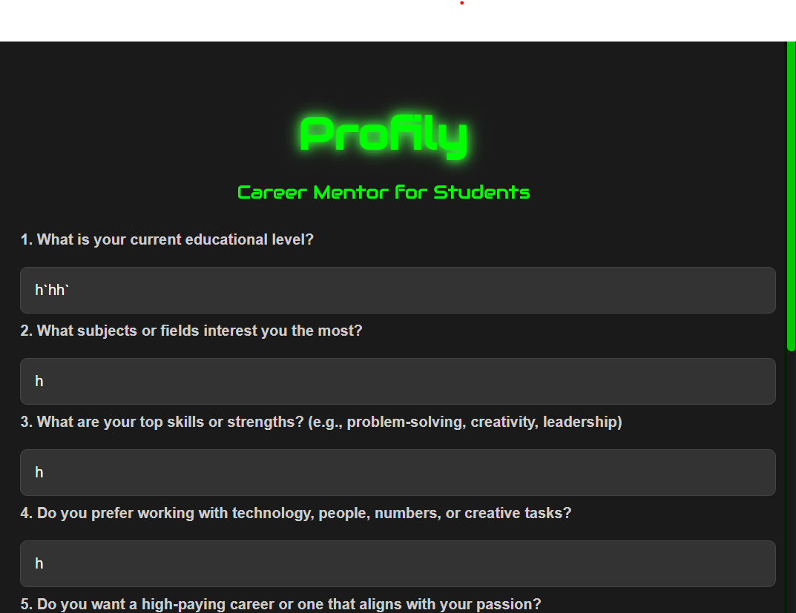

# Profily
<p align="center">

 

 <br>
Profily is a personalized career consulting web application that leverages the power of **DeepSeek R1** to provide tailored career advice based on user input. The tool helps users explore suitable career paths, industries, and actionable next steps based on their educational background, skills, preferences, and location.

## Features

- Provides personalized career advice.
- Considers user preferences, location, and future goals.
- Offers links to relevant universities and scholarship sites.
- Utilizes **DeepSeek R1**, a powerful AI model, for generating career suggestions.

## Tech Stack

- **Backend:** Flask (Python)
- **AI Model:** DeepSeek R1 (via aimlapi.com)
- **Environment Variables:** dotenv
- **Frontend:** HTML/CSS (with index.html template)

## Installation

1. **Clone the repository:**

```bash
https://github.com/yourusername/profily.git
```

2. **Navigate to the project directory:**

```bash
cd profily
```

3. **Create a virtual environment:**

```bash
python -m venv env
source env/bin/activate  # For Mac/Linux
env\Scripts\activate    # For Windows
```

4. **Install dependencies:**

```bash
pip install -r requirements.txt
```

5. **Create a .env file:**

```
API_KEY=your_api_key_here
BASE_URL=https://api.aimlapi.com/v1
```

6. **Run the Flask application:**

```bash
python app.py
```

## Usage

- Enter your career-related information.
- Receive personalized career advice with external resources and university/scholarship links.

## API Integration

Profily uses the DeepSeek R1 model via the AIML API to generate responses. 

- **System Prompt:** Sets up the AI as a career consultant.
- **User Prompt:** Collects user inputs and dynamically crafts personalized advice.
- **Max Tokens:** The conversation is limited to 2500 tokens.

## Project Structure

```
profily/
│
├── app.py          # Flask application
├── templates/
│   └── index.html  # Frontend template
├── .env             # Environment variables
├── requirements.txt # Python dependencies
└── README.md        # Project documentation
```

## Deployment

You can deploy Profily on platforms like Heroku, Vercel, or DigitalOcean.

1. **Prepare the environment variables.**
2. **Deploy the Flask app.**
3. **Ensure API key security and sensitive data handling.**

## Contribution

Contributions are welcome! Please fork the repository, create a branch, and submit a pull request.

## License

This project is licensed under the MIT License - see the LICENSE file for details.

## Acknowledgements

- **DeepSeek R1** - AI model powering career advice generation.
- **OpenAI API** - API integration for intelligent career suggestions.

For further details, refer to the project's documentation or contact the developer at [farheenimam331@gmail.com](mailto:farheenimam331@gmail.com).
Thank you for choosing **Profily**!

